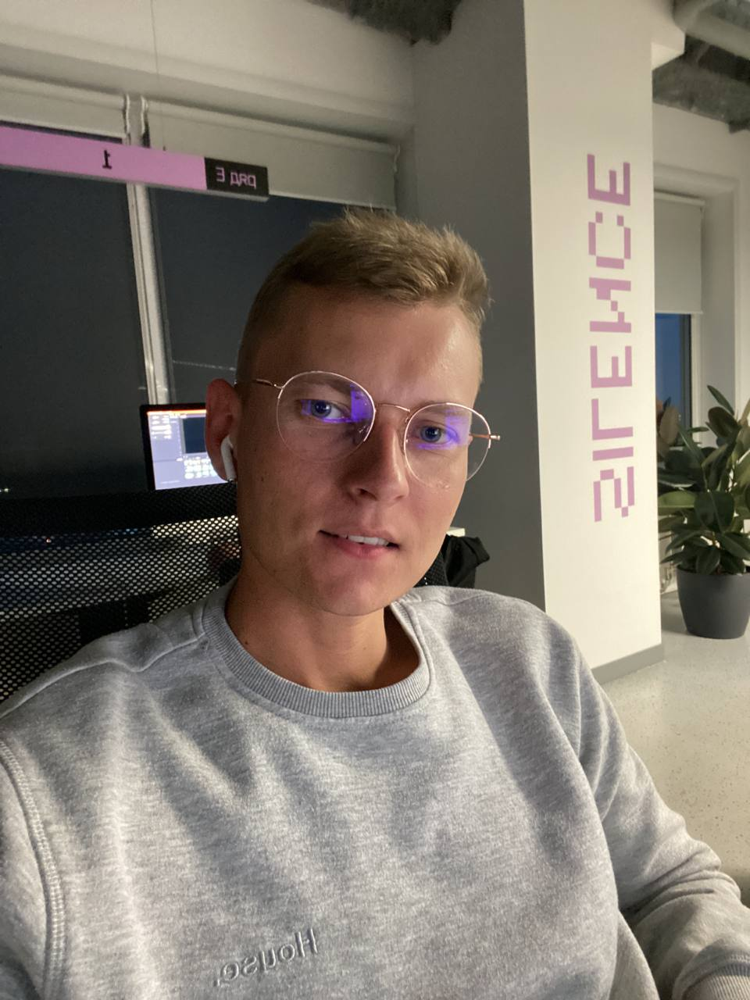
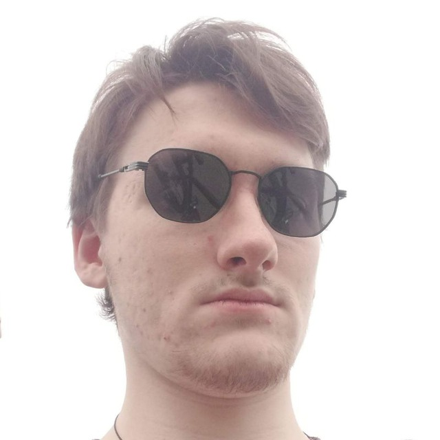
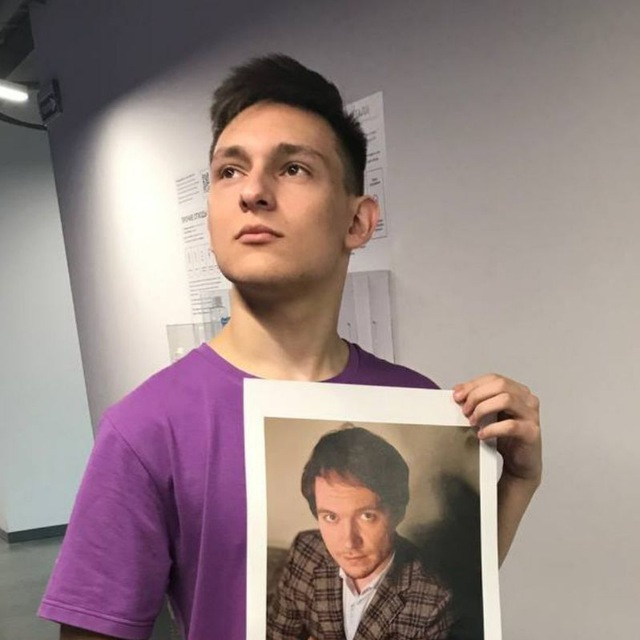
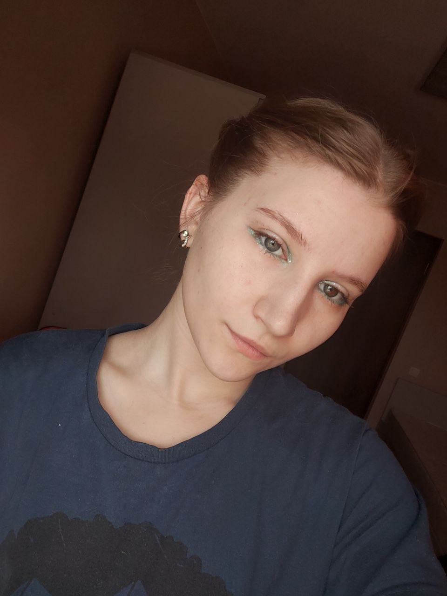
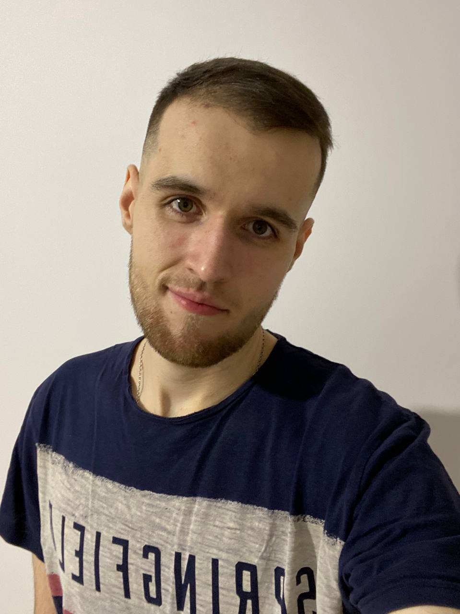

# Наша команда

Качественная команда — ключевой фактор успеха в любой сфере, будь то бизнес, спорт или соревнования. А когда на решение задачи отводится ограниченное количество времени (например, всего одна неделя, которая сопровождается жесткой конкурентной борьбой), вопрос становится гиперактуальным. Учитывая атмосферу соревновательности, даже малая ошибка может привести к холивару внутри команды и тотальному факапу. Именно поэтому очень важно собрать правильных людей.

Наша команда на проект Weeklyton состоит из 5 человек.

## Состав команды

#### 1. Тимлид - Курков Степан

В обязанности тимлида входят: 

* Формирование проектной команды для выполнения работ.
* Оценка рентабельности проекта.
* Анализ способности команды удовлетворить выявленные требования.
* Подготовка и согласование с командой детального плана выполнения работ.
* Контроль своевременного выполнения задач плана проекта членами проектной команды.
* Контроль соблюдения утверждённых норм рентабельности проекта.
* Контроль качества выполнения работ проектной командой Исполнителя.

#### 2. Техлид - Астахов Данил

В обязанности техлида входят: 

* Согласование Технического задания со своей командой.
* Передача Технического задания разработчику.
* Проработка и согласование командой промежуточных итогов проекта.
* Инновации в разработке технологических решений в команде.
* Устраняет технические неполадки и контролирует бизнес-процессы в целом с технической стороны, сводя риски для команды к минимуму.
* Берет на себя ответственность за техническую реализацию продукта.
* Помогает своей команде приобрести минимальные технические навыки для более эффективной работы в компании.
* Разрешает более сложные задания с технической стороны, которые иным разработчикам зачастую разрешить не под силу.

#### 3. Backend-разработчик - Абдужалилов Артём

В обязанности backend-разработчика входят:

* Разработка базовой логики и алгоритмов работы приложения.
* Разработка платформы и основного функционала.
* Работа с архитектурой кода.
* Внедрение необходимых интеграций с внешними сервисами.
* Разработка приложения, поддерживающего пользовательский интерфейс.
* Проектирование, настройка, оптимизация и модернизация баз данных

#### 4. Frontend-разработчик - Козырева Ольга

В обязанности frontend-разработчика входят:

* Работа с клиентской частью веб-ресурса, внешний вид и гармоничное распределение всех элементов.
* Настройка функционала (кнопок, слайдеров, форм, галерей и других элементов) и написание скриптов.
* Разработка платформы и основного функционала, то есть бизнес-логики.
* Проектирование UI и создание интерфейса с нуля.
* Проведение рефакторинга (улучшения и оптимизации кода) и ускорение работы телеграм-бота.

#### 5. Тестировщик - Ласкавых Александр

В обязанности тестировщика входят:

* Контроль качества разрабатываемых продуктов и анализ ошибок, которые могут возникнуть у конечных потребителей при использовании.
* Разработка тестовых наборов и их регулярный прогон, подготовка тестовых данных, написание методики тестирования.
* Анализ обнаруженных недочетов и их классификация.
* Разработка сценариев тестирования.
* Предоставление отчета по ошибкам разработчикам.
* Проведение финального тестирования после всех исправлений.